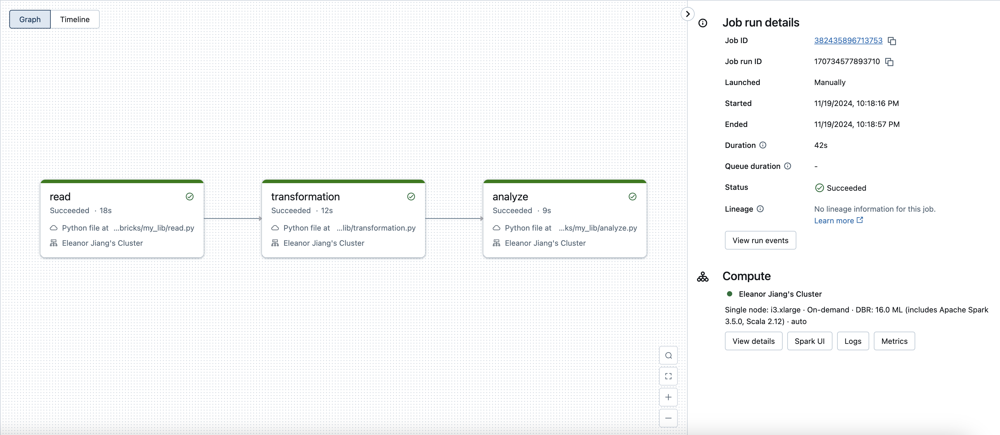

# data_pipeline_w-_databricks

---

## **Project Overview**

This project demonstrates the creation of a data pipeline using Databricks and Spark SQL. The pipeline reads data from a Databricks table containing serious injury outcome indicators from 2000 to 2022, performs data transformations and aggregations using Spark SQL, and writes the results to a new table for further analysis.

## **Features**

- **Data Source**: Databricks table `my_database.serious_injury_outcome_indicators_2000_2022`.
- **Data Processing**:
  - Filtering records where `Severity` is `'Fatal'`.
  - Grouping data by `Age` and calculating the total `Data_value` for each age group.
  - Ordering the results in descending order of total cases.
- **Data Sink**: The aggregated results are saved to a new Databricks table `my_database.injury_outcome_summary`.

## **Data Processing Details**

- **Filtering**: The pipeline filters records where the `Severity` column is `'Fatal'`, focusing the analysis on fatal injury cases.
- **Aggregation**: It groups the filtered data by `Age` and calculates the total number of cases (`Data_value`) for each age group.
- **Ordering**: The results are ordered in descending order to highlight the age groups with the highest number of fatal cases.

## **Dependencies**

- **PySpark**: For data processing with Spark.
- **Databricks CLI**: For interacting with Databricks from the command line (if automating deployment).

## **Contributing**

Contributions are welcome! Please fork the repository and submit a pull request with your changes.

## **License**

This project is licensed under the MIT License.
